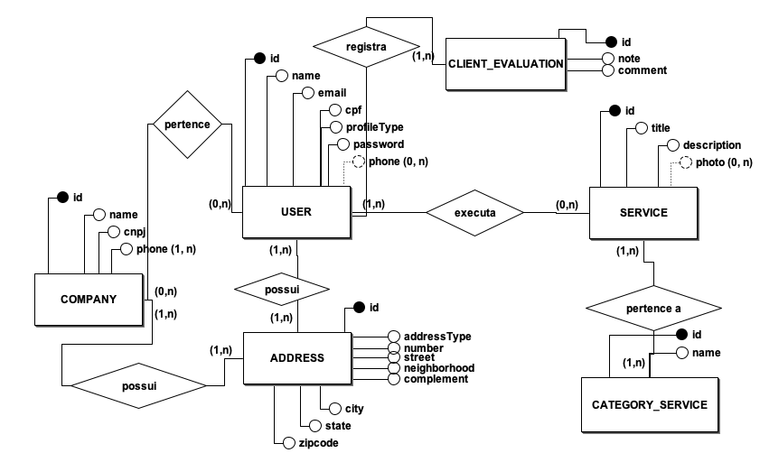

# 
 Modelagem banco de dados

## 1. Introdução

O documento em questão tem como objetivo documentar e apresentar a modelagem do banco de dados previamente definida e ir evoluindo de acordo com a evolução do software. 

Para essa modelagem, optaremos por utilizar um banco de dados relacional.

Traremos:

1. ME-R (Modelo entidade e relacionamento) 
Objetivo: Descrever os objetos do mundo real através de entidades, com suas propriedades que são os atributos e os seus relacionamentos.

2. DE-R (Diagrama Entidade-Relacionamento) 
Objetivo: Representar em forma gráfica o que foi descrito no MER (Modelo Entidade Relacionamento).

3. DE (Diagrama de esquemas) 
Objetivo: Representar a configuração lógica da totalidade ou de parte da base de dados relacional.

## 2. Modelo entidade e relacionamento (ME-R)

### Entidades

**USER** (<u>id</u>, name, email, cpf, password, profileType, {phone}) 
**ADDRESS** (<u>id</u>, addressType, number, street, neighborhood, complement, city, state, zipcode) 
**COMPANY** (<u>id</u>, name, cnpj, {phone}) 
**SERVICE** (<u>id</u>, title, description, {photo}) 
**CATEGORY_SERVICE** (<u>id</u>, name) 
**CLIENT_EVALUATION** (<u>id</u>, note, comment) 

### Relacionamentos

**USER** -> possui -> **ADDRESS**

Um **USER** tem um ou vários **ADDRESS** e um **ADDRESS** tem um ou vários **USER**

Cardinalidade -> **n:m**

**USER** -> pertence -> **COMPANY**

Um **USER** pertence a uma **COMPANY** e uma **COMPANY** possui vários **USER**

Cardinalidade -> **1:n**

**USER** -> executa -> **SERVICE**

Um **USER** executa vários **SERVICE** e um **SERVICE** é executado por um **USER**

Cardinalidade -> **1:n**

**USER** -> registra -> **CLIENT_EVALUATION**

Um **USER** registra vários **CLIENT_EVALUATION** e um **CLIENT_EVALUATION** é pertencente a um **USER**

Cardinalidade -> **1:n**

**COMPANY** -> possui -> **ADDRESS**

Uma **COMPANY** tem um ou vários **ADDRESS** e um **ADDRESS** tem uma ou várias **COMPANY**

Cardinalidade -> **n:m**

**SERVICE** -> pertence a -> **CATEGORY_SERVICE**

Um **SERVICE** pertence a um **CATEGORY_SERVICE** e um **CATEGORY_SERVICE** tem uma ou vários **SERVICE**

Cardinalidade -> **1:n**

**SERVICE** -> possui vários -> **CLIENT_EVALUATION**

Um **SERVICE** tem um ou vários **CLIENT_EVALUATION** e um **CLIENT_EVALUATION** possui um **SERVICE**

Cardinalidade -> **1:n**

## 3. Diagrama entidade e relacionamento (DE-R)

## 4. Versionamento

| Versão | Data       | Modificação          | Autor(es)           |
| :----: | ---------- | -------------------- | --------------- |
|  0.1   | 14/01/2022 | Criação do documento | Luís Fernando Furtado de Araújo |
|  0.2   | 14/01/2022 | Criação da introdução e subtópicos | Luís Fernando Furtado de Araújo |
|  0.3   | 14/01/2022 | Criação do ME-R | Luís Fernando Furtado de Araújo |
|  1.0   | 14/01/2022 | Adição do DE-R e revisões | Luís Fernando Furtado de Araújo |